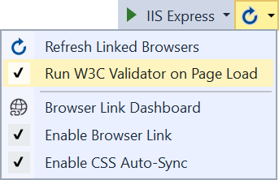
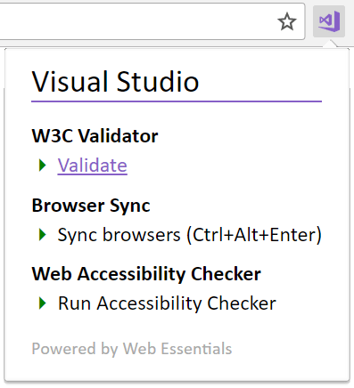
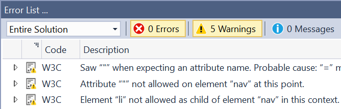

# W3C Validator

<!-- Update the VS Gallery link after you upload the VSIX-->
Download this extension from the [VS Marketplace](https://visualstudiogallery.msdn.microsoft.com/[GuidFromGallery])
or get the [CI build](http://vsixgallery.com/extension/5f8512da-c0df-4703-b72b-1d67315dd560/).

---------------------------------------

Validates any ASP.NET web application using the W3C validator on the rendered DOM running in the browser

See the [change log](CHANGELOG.md) for changes and road map.

## Features

- Run W3C validation on page load
- [Web Essentials Chrome extension](https://chrome.google.com/webstore/detail/web-essentials/mghdcdlpcdiodelbplncnodiiadljhhk) support

### Run on page load
By default, the validator runs when any ASP.NET generated page is loaded in the browser. That can be controlled from the Browser Link context menu on the *Standard* toolbar.

### Chrome extension
This extension support the [Web Essentials Chrome extension](https://chrome.google.com/webstore/detail/web-essentials/mghdcdlpcdiodelbplncnodiiadljhhk) to make it easy to run the validator directly from the browser.

### Error List
Errors show up in the Error List inside Visual Studio after running the validator.

## Contribute
Check out the [contribution guidelines](.github/CONTRIBUTING.md)
if you want to contribute to this project.

For cloning and building this project yourself, make sure
to install the
[Extensibility Tools 2015](https://visualstudiogallery.msdn.microsoft.com/ab39a092-1343-46e2-b0f1-6a3f91155aa6)
extension for Visual Studio which enables some features
used by this project.

## License
[Apache 2.0](LICENSE)